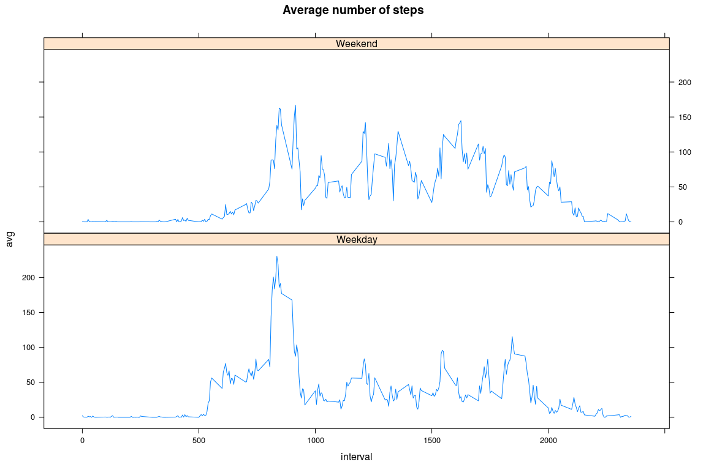

# Reproducible Research: Peer Assessment 1

## Presentation
This assignment makes use of data from a personal activity monitoring device. This device collects data at 5 minute intervals through out the day. The data consists of two months of data from an anonymous individual collected during the months of October and November, 2012 and include the number of steps taken in 5 minute intervals each day.
The interval number indicates the number of minutes since the beginning of the day.


## Loading and preprocessing the data

Reading the file, and computing date information in POSIXlt format.


## What is mean total number of steps taken per day?

Grouping data by day, remove days without observations, and compute total number of steps for each day.

Mean and median of the total number of steps in a day:

```
## [1] 10766.19
```

```
## [1] 10765
```

Histogram of the total number of steps in a day:
<!-- -->

## What is the average daily activity pattern?

<!-- -->

## Interval with the highest average number of steps

5 min interval with the highest average total number of steps:

```
## [1] 835
```

## Imputing missing values

Select NA values in the number of steps column, and replace them with the average number of steps in this interval computed on the other days. (So, if the number of steps in the interval number 10 is missing for a given day, we replace this missing value by the average over the other days of the number of steps in the interval number 10).


Mean and median of the total number of steps in a day, computed from the imputed data. 

```
## [1] 10766.19
```

```
## [1] 10766.19
```

Histogram of the imputed data.
<!-- -->

The imputed data gives very similar results to the non imputed data. This seems to indicate the NA values are homogeneously distributed among the intervals.

## Are there differences in activity patterns between weekdays and weekends?

Group the data by day, after splitting the data in two groups depending on the day of the week: weekday or weekend.

<!-- -->

The plot shows the average number of steps for each 5 min interval is more homogeneous during weekend days.
